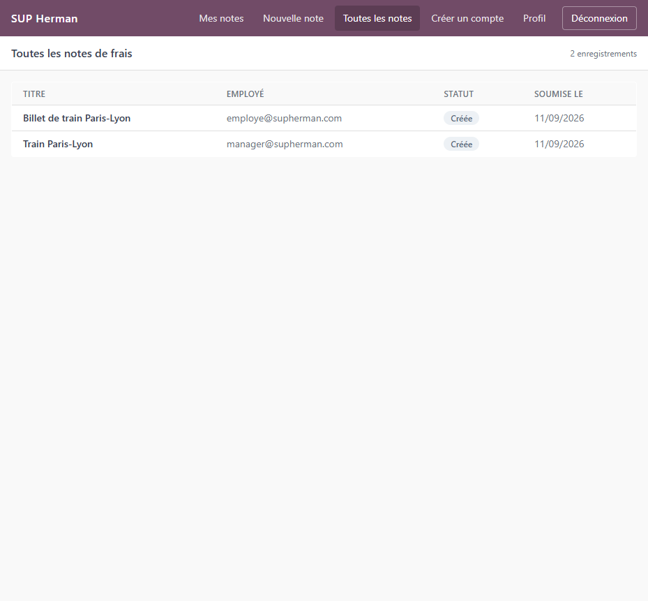

# xFINT1 - Gestion des notes de frais

Application web interne de gestion des notes de frais pour SUP Herman, développée dans le cadre
du module 3EXPI de SUPINFO.

Elle remplace un processus manuel qui reposait sur une conversation Slack et un tableur Excel.
Trois rôles, six pages, un parcours de validation unique et traçable.



## Sommaire

- [Fonctionnalités](#fonctionnalités)
- [Stack technique](#stack-technique)
- [Prérequis](#prérequis)
- [Démarrage rapide](#démarrage-rapide)
- [Comptes](#comptes)
- [Configuration](#configuration)
- [Lancer les tests](#lancer-les-tests)
- [Profil production](#profil-production)
- [Structure du projet](#structure-du-projet)
- [Documentation](#documentation)

## Fonctionnalités

| Page | Route | Accès |
| --- | --- | --- |
| Connexion | `/login` | public |
| Première connexion | `/activate?token=...` | public |
| Mes notes de frais | `/expenses` | tous les rôles |
| Déclarer une note | `/expenses/new` | tous les rôles |
| Toutes les notes | `/expenses/all` | Manager, Comptabilité |
| Profil | `/profile` | tous les rôles |
| Créer un compte | `/users/new` | Manager |

Une note de frais suit quatre statuts : **Créée**, **Validée**, **Refusée**, **Traitée**. Un
manager valide ou refuse, la comptabilité traite les notes validées. Personne ne peut décider
d'une note qu'il a lui-même déclarée.

Les justificatifs acceptés sont les PDF, JPEG et PNG, jusqu'à 10 fichiers de 5 Mo par note. Le
type est vérifié sur le contenu réel du fichier, pas sur son extension.

## Stack technique

| Couche | Choix |
| --- | --- |
| Backend | FastAPI, SQLAlchemy 2.0, Alembic, Pydantic v2 |
| Base de données | PostgreSQL 16 |
| Frontend | React 18, TypeScript, Vite, Tailwind CSS |
| Authentification | JWT dans un cookie httpOnly, bcrypt |
| Tests | pytest (209 tests), Vitest (19 tests) |
| Déploiement | Docker Compose |

La justification de chacun de ces choix est dans [docs/architecture.md](docs/architecture.md).
Le code, les commentaires et l'historique git sont en anglais ; l'interface et la documentation
destinée aux utilisateurs sont en français.

## Prérequis

- Docker
- Docker Compose

Rien d'autre. Python et Node tournent dans les conteneurs, il n'est pas nécessaire de les
installer sur la machine.

## Démarrage rapide

```bash
git clone https://github.com/Karasu-huginn/xFINT1.git
cd xFINT1
docker compose up --build
```

Au premier démarrage, l'API applique les migrations et crée le compte manager obligatoire. Aucune
étape de configuration n'est requise.

Une fois la stack démarrée :

| Service | URL |
| --- | --- |
| **Application** | <http://localhost:5173> |
| État de santé de l'API | <http://localhost:8000/api/health> |
| Documentation interactive (Swagger UI) | <http://localhost:8000/api/docs> |
| Documentation alternative (ReDoc) | <http://localhost:8000/api/redoc> |
| Schéma OpenAPI | <http://localhost:8000/api/openapi.json> |

Pour arrêter et repartir d'une base vierge :

```bash
docker compose down -v
```

## Comptes

Le compte manager est créé automatiquement à chaque démarrage.

| Adresse e-mail | Mot de passe | Rôle |
| --- | --- | --- |
| `manager@supherman.com` | `Suph3rm4n!` | Manager |

Les comptes employé et comptabilité se créent depuis l'application, page **Créer un compte**,
accessible à un manager. La création produit un lien d'activation à transmettre à la personne
concernée ; l'application n'envoie aucun e-mail.

## Configuration

Créer un fichier `.env` est **optionnel**. Chaque variable possède une valeur de développement
fonctionnelle, déclarée dans `docker-compose.yml`. Créez-en un uniquement pour surcharger une
valeur :

```bash
cp .env.example .env
```

`.env` est ignoré par git.

| Variable | Valeur par défaut | Rôle |
| --- | --- | --- |
| `POSTGRES_USER` | `xfint1` | Utilisateur du conteneur PostgreSQL |
| `POSTGRES_PASSWORD` | `change_me` | Mot de passe du conteneur PostgreSQL |
| `POSTGRES_DB` | `xfint1` | Base créée au démarrage |
| `DATABASE_URL` | `postgresql+psycopg://xfint1:change_me@db:5432/xfint1` | Chaîne de connexion applicative |
| `TEST_DATABASE_URL` | `postgresql+psycopg://xfint1:change_me@db:5432/xfint1_test` | Base dédiée aux tests |
| `SECRET_KEY` | `dev_only_change_me_not_a_real_secret` | Clé de signature des jetons de session |
| `ACCESS_TOKEN_EXPIRE_HOURS` | `8` | Durée de validité d'une session |
| `ACTIVATION_TOKEN_EXPIRE_DAYS` | `7` | Durée de validité d'un lien d'activation |
| `COOKIE_SECURE` | `false` | Restreint le cookie de session à HTTPS |
| `UPLOAD_DIR` | `/uploads` | Répertoire de stockage des justificatifs |
| `MAX_UPLOAD_SIZE_MB` | `5` | Taille maximale par fichier |
| `MAX_FILES_PER_REPORT` | `10` | Nombre maximal de fichiers par note |
| `FRONTEND_ORIGIN` | `http://localhost:5173` | Origine autorisée par CORS |
| `SEED_MANAGER_EMAIL` | `manager@supherman.com` | Compte manager créé au démarrage |
| `SEED_MANAGER_PASSWORD` | `Suph3rm4n!` | Mot de passe de ce compte |

**À propos de `SECRET_KEY`.** La valeur par défaut est commitée volontairement : c'est ce qui
permet au projet de démarrer sans aucune configuration sur une machine inconnue. Elle signe les
cookies de session, donc toute personne connaissant cette valeur peut forger une session manager
sur un déploiement qui ne l'a pas changée. C'est le bon compromis pour un projet évalué, et ce
n'est pas ce qu'on déploierait. Pour un usage réel :

```bash
openssl rand -hex 32
```

## Lancer les tests

```bash
docker compose run --rm api pytest        # backend, 209 tests
docker compose run --rm web npm test      # frontend, 19 tests
```

Les tests backend s'exécutent contre PostgreSQL, dans une base `xfint1_test` séparée, et non
contre SQLite. La raison est expliquée dans
[docs/architecture.md](docs/architecture.md#12-testing-strategy).

Vérification des types du frontend :

```bash
docker compose run --rm web npm run typecheck
```

## Profil production

Par défaut, le service `web` lance le serveur de développement Vite avec rechargement à chaud,
parce que c'est le mode le plus simple à exécuter pour quelqu'un qui découvre le projet. Un profil
`prod` construit le bundle statique et le sert depuis nginx :

```bash
docker compose --profile prod up --build
```

L'application est alors disponible sur <http://localhost:8080>.

## Structure du projet

```
xFINT1/
├─ docker-compose.yml     Topologie des services : db, api, web
├─ .env.example           Toutes les variables d'environnement, documentées
├─ backend/               API FastAPI
│  ├─ alembic/            Migrations de base de données
│  ├─ app/
│  │  ├─ core/            Configuration, sécurité, dépendances, exceptions
│  │  ├─ auth/            Connexion, session, activation
│  │  ├─ users/           Création de comptes
│  │  ├─ expenses/        Notes de frais et machine à états
│  │  └─ storage/         Validation et stockage des fichiers
│  ├─ seed.py             Création du compte manager obligatoire
│  └─ tests/
├─ frontend/              Application React
│  └─ src/
│     ├─ api/             Client HTTP typé
│     ├─ auth/            Contexte de session et gardes de route
│     ├─ components/      Composants du système de design
│     ├─ features/        Composants liés aux notes de frais
│     ├─ labels/          Traductions françaises
│     └─ pages/           Une page par écran du sujet
└─ docs/                  Documentation technique et manuel utilisateur
```

## Documentation

| Document | Pour qui |
| --- | --- |
| [docs/user-manual.md](docs/user-manual.md) | Les utilisateurs de SUP Herman : comment déclarer, valider et traiter une note |
| [docs/architecture.md](docs/architecture.md) | Les développeurs et les évaluateurs : choix d'architecture, modèle de données, sécurité, limites connues |

## Contexte

Projet scolaire réalisé pour le module 3EXPI de SUPINFO.
