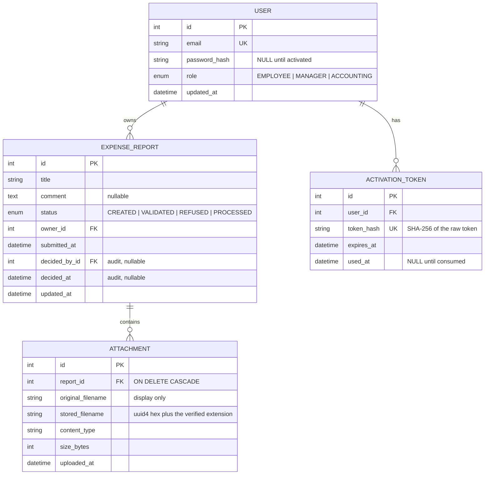
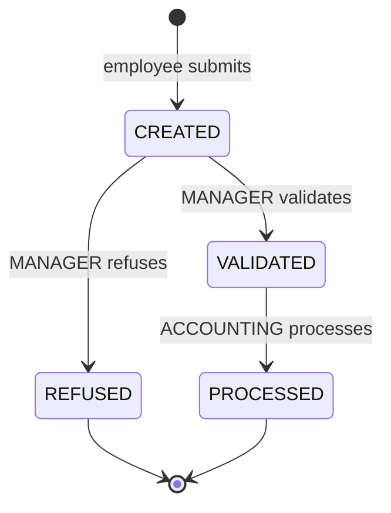

# Technical documentation

How the SUP Herman expense report application is built, and why each structural decision was
made rather than its obvious alternative.

## Contents

- [1. Overview](#1-overview)
- [2. Stack](#2-stack)
- [3. Repository layout](#3-repository-layout)
- [4. The dependency rule](#4-the-dependency-rule)
- [5. The transaction boundary](#5-the-transaction-boundary)
- [6. The error contract](#6-the-error-contract)
- [7. Data model](#7-data-model)
- [8. The status state machine](#8-the-status-state-machine)
- [9. Authentication and authorisation](#9-authentication-and-authorisation)
- [10. Uploads](#10-uploads)
- [11. The interface](#11-the-interface)
- [12. Testing strategy](#12-testing-strategy)
- [13. Known limitations](#13-known-limitations)

---

## 1. Overview

Three containers: PostgreSQL, a FastAPI service exposing a REST API under `/api`, and a React
single page application. The API owns every rule. The frontend renders them and enforces nothing.

```
browser  ->  web (Vite dev server, proxies /api)  ->  api (FastAPI)  ->  db (PostgreSQL 16)
                                                        |
                                                     uploads volume
```

## 2. Stack

| Layer | Choice |
| --- | --- |
| Backend | FastAPI, SQLAlchemy 2.0, Alembic, Pydantic v2 |
| Database | PostgreSQL 16 |
| Frontend | React 18, TypeScript, Vite, Tailwind CSS |
| Auth | JWT in an httpOnly cookie, bcrypt |
| Tests | pytest against PostgreSQL, Vitest on the frontend |
| Delivery | Docker Compose |

The brief leaves the stack free, so each choice has to answer for itself.

**FastAPI rather than Django.** Django hands you authentication, an admin, an ORM and a project
layout. That is an advantage in most contexts and a disadvantage here: the architecture would be
Django's, not ours, and there would be little left to justify. FastAPI provides routing,
validation and dependency injection, and leaves the structure open. Every decision in this
document is therefore one we actually made.

**PostgreSQL rather than SQLite.** The brief marks database modelling. Native enum types, real
foreign key actions such as `ON DELETE CASCADE` and `ON DELETE SET NULL`, and `timestamptz`
semantics all behave differently in SQLite, so a schema designed against SQLite would be a
different schema.

**Docker Compose.** A grader must not be able to fail to run the project. `docker compose up`
starts the database, applies the migrations, seeds the mandatory account and serves both the API
and the interface, with no configuration step.

## 3. Repository layout

```
xFINT1/
├─ docker-compose.yml          db, api, web, and the prod profile
├─ .env.example                every variable, documented
├─ backend/
│  ├─ alembic/                 migration environment and versions
│  ├─ app/
│  │  ├─ main.py               app factory, CORS, router registration
│  │  ├─ core/                 config, database, security, dependencies, exceptions, enums
│  │  ├─ auth/                 login, logout, session, activation
│  │  ├─ users/                account provisioning
│  │  ├─ expenses/             reports, attachments, the transition table
│  │  └─ storage/              upload validation and file persistence
│  ├─ seed.py                  idempotent seeding of the mandatory manager
│  └─ tests/
├─ frontend/
│  └─ src/
│     ├─ api/                  typed fetch client, one module per resource
│     ├─ auth/                 session context and route guards
│     ├─ components/           presentational pieces that know nothing of expenses
│     ├─ features/             pieces that do know about expenses
│     ├─ labels/               every French string derived from an API value
│     ├─ pages/                one file per briefed page
│     └─ types/                the API contract as TypeScript types
└─ docs/
```

**Modules are vertical slices by domain, not horizontal layers.** There is no top-level
`models/`, `services/` and `routers/`. Instead `auth/`, `users/` and `expenses/` each contain
their own model, schema, service and router.

The reason is how the code is read. A change to how a report is validated touches
`expenses/service.py` and `expenses/router.py`, which sit next to each other. Under horizontal
layers the same change would touch three directories, and reading a feature end to end would mean
jumping between them. Files also stay small: the largest module here is under 200 lines.

`core/enums.py` is the one place that breaks the slicing, and deliberately. `Role` is needed by
`expenses/service.py` and `Status` by the frontend contract, so defining either inside a slice
would create an import cycle between `users/` and `expenses/`.

The frontend applies the same idea with a different axis. `components/` holds pieces that know
nothing about expense reports and could be lifted into another application unchanged;
`features/` holds the pieces that do. That split is what keeps the design system reusable and the
domain logic findable.

## 4. The dependency rule

Dependencies point one way and never back:

```
router  ->  service  ->  model
```

- **Routers** own HTTP. They parse and validate input through Pydantic, call a service and
  serialise the result. They contain no business rule.
- **Services** own the business rules and are the only place that decides whether an action is
  permitted. They import no FastAPI or Starlette type and raise domain exceptions.
- **Models** own persistence and nothing else.

The value of stating this is that it can be checked rather than believed:

```console
$ grep -rn --include="*.py" "HTTPException" backend/app | grep -v "core/exceptions.py"
$ grep -rn "fastapi" backend/app/*/service.py backend/app/storage/files.py
```

Both return nothing. `HTTPException` appears only in `core/exceptions.py`, and no service imports
a web framework type. A rule you can disprove in five seconds is worth more than a paragraph
asserting one.

The practical consequence is that the business rules are callable without HTTP. `test_transitions.py`
exercises the full status matrix by calling `apply_status_transition` directly, with no client and
no request, because the rules do not know what a request is.

## 5. The transaction boundary

**Services call `session.flush()`. Routers call `session.commit()`.** Never the reverse.

A service therefore composes: `apply_status_transition` can call `get_visible_report` without
either of them committing halfway through, and the router decides when the unit of work ends.
This convention is not visible in any type signature, which is why it is written down here.

## 6. The error contract

Services raise domain exceptions. `core/exceptions.py` is the only place that turns one into a
status code, and every response carries the same shape:

```json
{ "detail": "A report cannot go from CREATED to PROCESSED", "code": "transition_not_allowed" }
```

| Condition | Status | Code |
| --- | --- | --- |
| Input fails a business rule | 400 | `validation_failed` |
| Input fails schema validation | 422 | `validation_error` |
| Missing or invalid session | 401 | `authentication_failed` |
| Role not permitted | 403 | `permission_denied` |
| Not found, or not visible | 404 | `not_found` |
| Duplicate email | 409 | `conflict` |
| Impossible status change | 409 | `transition_not_allowed` |
| File too large | 413 | `file_too_large` |
| Disallowed file type | 415 | `unsupported_file_type` |

The `code` field is not decoration. The API answers in English because its messages are part of a
contract, while the interface is French. The frontend maps `code` to a French sentence in
`src/labels/fr.ts`, so no backend string ever reaches a user.

**404 rather than 403 for a resource the caller may not see.** A 403 confirms that the record
exists. An employee could then walk report ids and learn exactly how many expense claims a
colleague has filed, without reading any of them. Invisible and absent must be indistinguishable,
so `get_visible_report` raises `NotFoundError` in both cases.

## 7. Data model



Three decisions worth defending.

**`password_hash` is nullable rather than a separate `is_active` boolean.** An invited user who
has not yet chosen a password has no hash, so the schema itself encodes the state. A boolean
beside the hash would be a second source of truth that can drift: a row with a hash and
`is_active = false` is meaningless, but the schema would permit it.

**`token_hash` stores a SHA-256 digest, never the raw token.** The manager sees the raw value
exactly once, and a database leak yields nothing usable. This is the same reasoning as hashing a
password, applied consistently to the other secret the system holds.

**`submitted_at` replaces `created_at` rather than sitting beside it.** There is no draft status,
so creating a report is submitting it. Two columns would hold the same value on every row and
would eventually diverge through some later code path, at which point one of them would be lying.

Timestamps are `timestamptz` with a `now()` server default. A Python-side default would be
computed in the application's timezone and interpreted by Postgres in the session's timezone, two
values that agree only by accident. `test_reports_model.py` pins this by forcing a non-UTC session
timezone before the insert and asserting the stored instant has not drifted.

## 8. The status state machine



Every rule lives in one table, in `expenses/service.py`:

```python
ALLOWED_TRANSITIONS: dict[tuple[Status, Status], Role] = {
    (Status.CREATED,   Status.VALIDATED): Role.MANAGER,
    (Status.CREATED,   Status.REFUSED):   Role.MANAGER,
    (Status.VALIDATED, Status.PROCESSED): Role.ACCOUNTING,
}
```

Nothing else in the codebase assigns to `status`:

```console
$ grep -rn --include="*.py" "\.status = " backend/app
backend/app/expenses/service.py:139:    report.status = target_status
```

This is why the API exposes a single `PATCH /api/reports/{id}/status` carrying the target status,
rather than three action endpoints `/validate`, `/refuse` and `/process`. Action endpoints read
more explicitly, but they would scatter the rules across three handlers and the table would stop
being the single source of truth. With one PATCH the handler looks up
`(current, target) -> required_role` and delegates: the table *is* the API.

`apply_status_transition` checks in a fixed order, and the order is itself a decision:

1. **Visibility.** A report the caller cannot see raises `NotFoundError` before any transition
   rule is consulted, so the endpoint cannot be used to probe which reports exist.
2. **The pair.** A pair absent from the table is impossible for everybody, whatever their role,
   and raises `TransitionNotAllowedError` (409).
3. **The role.** A pair present but attempted by the wrong role is a permission failure (403),
   not a conflict. Collapsing this into the previous case would report an impossible action and
   an unauthorised one identically.
4. **Ownership.** See below.

**Refusal and processing are terminal.** Neither can be undone. An expense claim that could be
re-opened after being refused would make the audit columns meaningless, and a manager who changes
their mind can ask for a new claim.

**Nobody decides on their own report.** Managers may submit expenses of their own, since the
declaration page is open to every role, but a manager cannot validate or refuse a report they
own, and an accountant cannot process one. The brief does not mention this case, so it is a
deliberate policy decision: separation of duties. Whoever engages a cost never approves it. The
service enforces it and the interface additionally draws no buttons, so the rule is visible
rather than merely enforced.

## 9. Authentication and authorisation

### Sessions

Login verifies a bcrypt hash, then issues a JWT carrying the user id, the role and an expiry,
signed with `SECRET_KEY`. It travels in an **httpOnly, SameSite=Lax** cookie, `Secure` in
production.

httpOnly means script cannot read it, which rules out the most common way a session token is
stolen. It also has a design consequence worth naming: the frontend cannot decode a role out of
the cookie, so it calls `GET /api/auth/me` on mount and the server remains the sole authority on
identity.

Expiry is 8 hours, one working day, with no refresh token. Re-logging in is a non-event for an
internal tool, and a refresh mechanism would be machinery to justify without anything earned.

Unknown email and wrong password return an identical message, and the code verifies a dummy hash
when the email is unknown so the two paths take comparable time. Without that, response timing
alone would reveal which addresses belong to staff.

### Two layers

Route guards answer *may this role reach this endpoint at all*, and fail with 403 before any
query runs:

```python
current_user: User = Depends(require_roles(Role.MANAGER, Role.ACCOUNTING))
```

Service checks answer *may this user act on this row*, and live next to the data they judge.

Both are required. Route guards alone would let an employee fetch a colleague's report by
guessing its id, since `GET /api/reports/{id}` is open to every role. Service checks alone would
run business logic for callers who should never have arrived.

| Endpoint | Employee | Manager | Accounting |
| --- | --- | --- | --- |
| `POST /auth/login`, `/auth/activate` | public | public | public |
| `GET /auth/me`, `POST /auth/logout` | yes | yes | yes |
| `POST /users` | no | yes | no |
| `GET /reports/mine`, `POST /reports` | yes | yes | yes |
| `GET /reports` | no | all reports | VALIDATED and PROCESSED only |
| `GET /reports/{id}` | own only | any | only if visible |
| `PATCH /reports/{id}/status` | no | validate, refuse | process |
| `GET /attachments/{id}` | own reports only | any | only on visible reports |

### Activation

A manager creates an account with no password. The API mints
`secrets.token_urlsafe(32)`, stores only its SHA-256 digest, and returns the raw token **once**.

`POST /api/users` deliberately returns `activation_token`, not a ready-made URL. The API has no
knowledge of the origin it is served from, and inventing one would either hard-code a deployment
detail into a service that must not care about it, or add a configuration variable that can drift
out of step with reality. The frontend owns its own routing, so the frontend composes the link.

Tokens are single use and expire after 7 days. Consumed, expired and forged tokens all return the
same generic error, so the endpoint cannot be used to learn which tokens ever existed.

Two details in `activate_account` are deliberate. The lookup takes a row lock with
`with_for_update()`, because `used_at` is read in one statement and written in another: without
the lock, two requests racing on the same token both read it as unconsumed and both succeed, and a
double-clicked submit button is enough to get there. And the password policy is checked **before**
the token is looked up, so a password the policy rejects leaves the invitation usable. Burning
somebody's only invite on a typo would be unrecoverable for them.

## 10. Uploads

Every rule about bytes lives at one chokepoint, `app/storage/files.py`. No other module inspects
file content.

1. **Size.** 5 MB per file, configurable. The router reads at most the limit plus one byte per
   upload, which is enough to prove a payload is oversized without buffering the whole of it.
2. **Count.** Between 1 and 10 files per report, configurable. The brief says "une ou plusieurs
   pieces justificatives", read as a minimum of one.
3. **Type.** An allowlist of PDF, JPEG and PNG, decided by **reading the leading magic bytes**.
   The declared `Content-Type` is client-controlled and can simply lie, so it is never trusted.
4. **Path.** The stored name is `uuid4().hex` plus an extension derived from the *verified* type,
   never from user input. The resolved path is then asserted to remain inside the upload
   directory.

Size is checked before type, so a caller sending a 40 MB executable is told it is too large by the
cheaper of the two checks.

The database holds metadata only. Files live on the `uploads` volume under their generated name,
and the original filename is kept for display and returned in a `Content-Disposition` header using
RFC 5987 encoding, because an uploaded name may contain quotes, semicolons or accents.

## 11. The interface

### Why it looks like this

An expense workflow is business software, and business software has a visual grammar that its
users already read fluently. Odoo is the reference implementation of that grammar in this segment
of the market, and it is what an accountant at a company of this size is most likely to have used
before.

So the interface borrows Odoo's vocabulary rather than inventing one: the dark branded navbar, the
light control panel strip carrying the breadcrumb on the left and the record count on the right,
the shadowed white sheet for forms, the dense list view with small-caps headers, and dialog
buttons aligned left rather than right.

The strongest case is the **status bar**. Odoo draws the lifecycle of a record as a pipeline of
stages across the top, with the current one filled in. Applied here it renders
`Créée > Validée > Traitée`, which puts the state machine of section 8 on screen. A rule the
backend enforces becomes something a user can see, and "why can I not validate this" stops being
a question.

The palette is Odoo's own: `#714B67` as primary, `#017E84` as accent, a light grey canvas and
white sheets. Type is a system stack led by Roboto and no webfont is fetched, so the application
renders identically on a machine with no network access, which a grader may well be.

### French is a presentation concern

The API speaks `EMPLOYEE`, `MANAGER`, `ACCOUNTING`, `CREATED`, `VALIDATED`, `REFUSED` and
`PROCESSED`. Those strings are never displayed. Every translation lives in `src/labels/fr.ts`,
including the map from an error `code` to a French sentence, so changing a wording is a one-file
change and no English can leak into the interface.

### Client-side gating is not security

`ProtectedRoute` redirects anonymous visitors and `RoleGate` hides routes a role cannot use. The
navbar shows only the entries that apply.

**None of this enforces anything.** It is there so that users are not shown actions that would
fail. Every call is re-authorised server-side, and a user who edits their way past a hidden button
receives a 403, a 404 or a 409 exactly as if the button had never been hidden.

### Responsive

Pages 2 and 4 are tables, which is where mobile layouts fail. Below the `md` breakpoint the same
data renders as stacked cards instead, with the title and status prominent, rather than as a table
that scrolls sideways. The navbar collapses behind a menu button. Every other page is a
single-column form and is responsive by construction. The whole application is usable at 375 px.

## 12. Testing strategy

```console
$ docker compose run --rm api pytest        # 209 tests
$ docker compose run --rm web npm test      # 19 tests
```

**The backend suite runs against PostgreSQL, not SQLite.** In-memory SQLite would be faster but
diverges on native enums, foreign key actions and `timestamptz` handling, so the tests would be
proving things about a database we do not ship. A separate `xfint1_test` database is created in
the same container and each test runs inside a transaction that is rolled back.

The suite covers security primitives, the error handlers, account provisioning, the activation
lifecycle including expired and reused tokens, the mandatory grader credentials, upload
validation, report visibility, the status matrix and attachment authorisation.

`test_transitions.py` is worth describing, because the obvious version of it proves less than it
appears to. It runs three tests:

- All 16 status pairs judged by a **manager**, who can see every report. Visibility never masks
  the transition rule here, so this is the exhaustive proof of the table itself.
- All 48 combinations of source status, target status and role, each of which must resolve
  through the documented check order and nowhere else.
- A **literal assertion on the outcome counts**: exactly 3 moved, 24 not found, 1 wrong role and
  20 impossible.

The third exists because the first two derive their expectations from `ALLOWED_TRANSITIONS`. Add a
fourth entry to that table and they happily agree with it. Only the count assertion and the direct
equality assertion on the table's contents detect the change. This was confirmed by mutation:
adding `(REFUSED, VALIDATED)` left all 64 parametrised cases green and failed exactly those two.

Frontend testing is deliberately narrow. Vitest covers the pure modules: the error envelope
parsing, the French label maps, and the decision about which action buttons a role may see.
Components and pages were verified in a real browser against the running stack, which is what
actually demonstrates the six pages work. This scope is a choice, not an omission: component tests
would duplicate rules already exhaustively tested on the backend, where they are enforced.

## 13. Known limitations

Named here because an acknowledged trade-off is engineering and the same gap left unmentioned is
an oversight.

1. **The activation secret travels in a URL path.** Proxies, browser history and access logs
   capture it. Mitigated by single use, a 7 day expiry and SHA-256 at rest. Moving it into a
   request body would break the activation *link* the brief describes.
2. **The JWT is stateless with no denylist.** Logout clears the cookie client-side only, so a
   token captured beforehand stays valid for the remainder of its 8 hours.
3. **500 responses carry no CORS headers.** Starlette routes `Exception`-keyed handlers through
   `ServerErrorMiddleware`, which sits outside `CORSMiddleware`. The uniform error contract of
   section 6 therefore holds on every response *except* an unhandled 500.
4. **`SECRET_KEY` ships with a working committed default.** That is what lets the stack run with
   zero configuration on a stranger's machine, which the brief effectively requires. It also means
   anyone can mint a valid manager cookie against a deployment that never changed it. Correct for
   a graded project, wrong for production, and stated rather than hidden.
5. **Account provisioning has a check-then-insert race.** Two simultaneous requests for the same
   address surface as a 500 rather than a 409. The unique index preserves integrity; only the
   status code degrades.
6. **There is no login rate limiting.**
7. **There is no password reset for an activated user.** A manager cannot restore access, so the
   account has to be recreated under another address.
8. **No email is sent.** Activation links are handed over by the manager, which is why no SMTP
   configuration exists anywhere in the project.

## Grading map

| Criterion | Where it is addressed |
| --- | --- |
| Authentication and role management | Sections 9, 6 |
| Employee features | Sections 8, 10, 11 |
| Manager and accounting features | Sections 8, 9 |
| Overall code quality | Sections 4, 5, 6, 12 |
| Architecture | Sections 2, 3, 4, 7, 8 |
| UI and UX, responsive | Section 11 |
| Documentation | This file, `../README.md`, `user-manual.md` |
