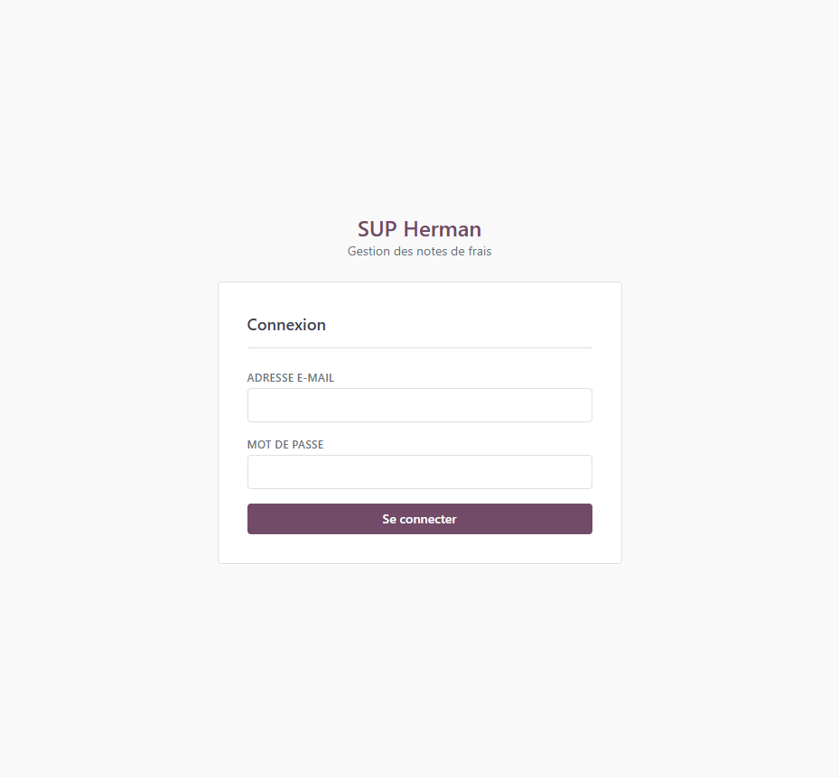
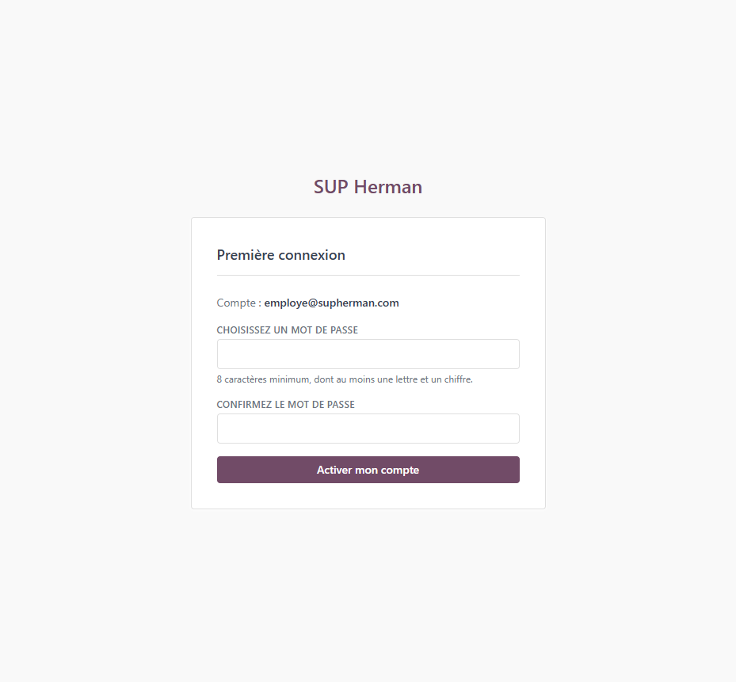
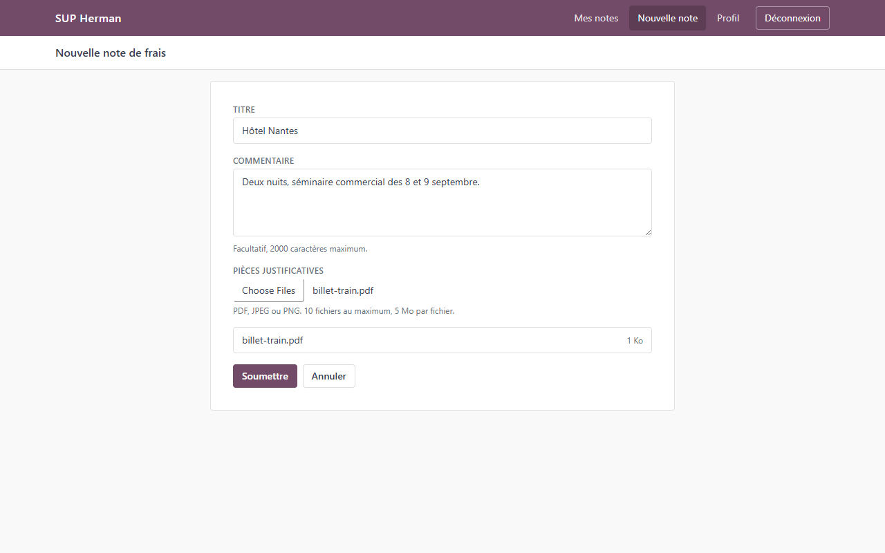
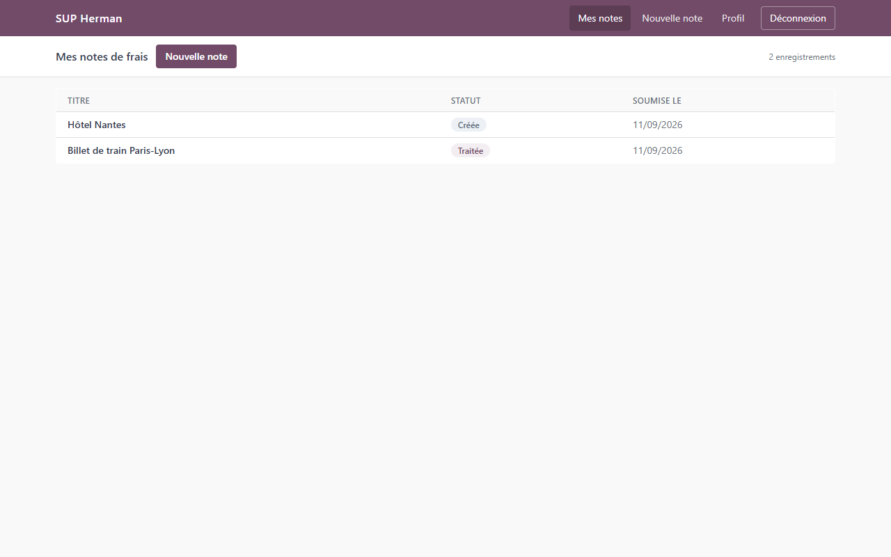
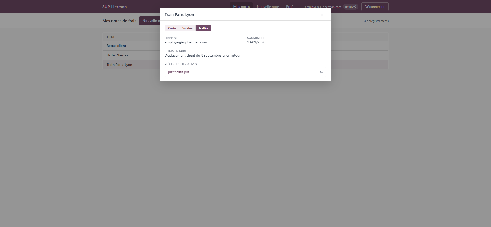
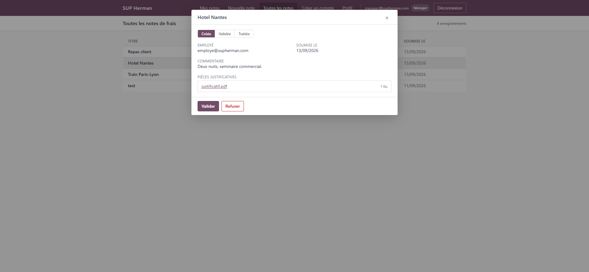
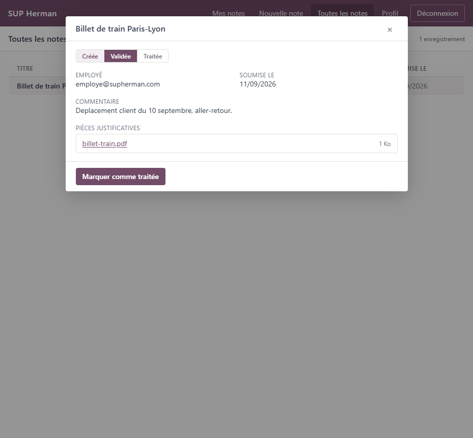
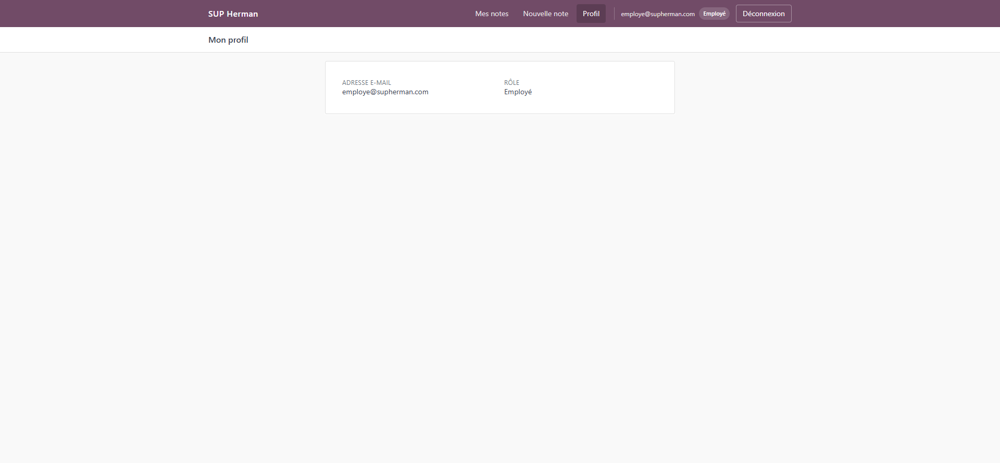
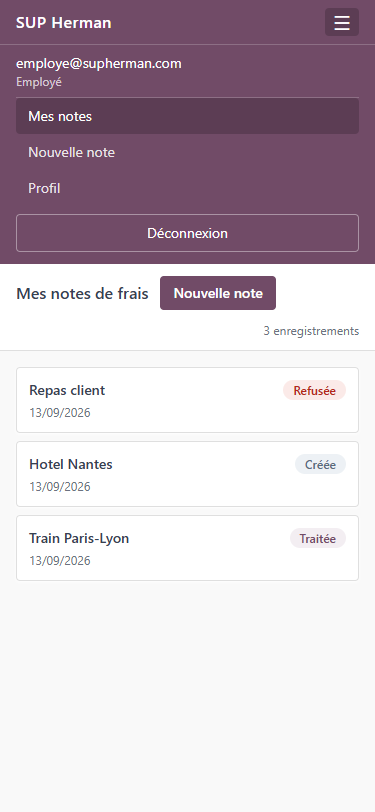

# Manuel utilisateur

Application interne de gestion des notes de frais de SUP Herman.

## Sommaire

1. [À quoi sert cette application](#1-à-quoi-sert-cette-application)
2. [Se connecter](#2-se-connecter)
3. [Première connexion](#3-première-connexion)
4. [Déclarer une note de frais](#4-déclarer-une-note-de-frais)
5. [Suivre ses notes de frais](#5-suivre-ses-notes-de-frais)
6. [Valider ou refuser une note (Manager)](#6-valider-ou-refuser-une-note-manager)
7. [Traiter une note (Comptabilité)](#7-traiter-une-note-comptabilité)
8. [Créer un compte (Manager)](#8-créer-un-compte-manager)
9. [Consulter son profil](#9-consulter-son-profil)
10. [Sur téléphone](#10-sur-téléphone)
11. [Questions fréquentes](#11-questions-fréquentes)

---

## 1. À quoi sert cette application

Jusqu'ici, les notes de frais circulaient dans une conversation Slack et finissaient dans un
tableur. Une note pouvait se perdre, un justificatif manquer, et personne ne savait dire où en
était un remboursement.

Cette application remplace les deux. Chaque note y est déposée avec ses justificatifs, suit un
parcours unique et visible, et personne n'a besoin de demander où elle en est.

Trois rôles existent :

| Rôle | Ce qu'il peut faire |
| --- | --- |
| **Employé** | Déclarer ses notes de frais et suivre les siennes |
| **Manager** | Tout ce que fait un employé, plus valider ou refuser les notes des autres et créer des comptes |
| **Comptabilité** | Tout ce que fait un employé, plus marquer comme traitées les notes validées |

## 2. Se connecter

Rendez-vous sur l'adresse de l'application, saisissez votre adresse e-mail professionnelle et
votre mot de passe.



**Vous ne pouvez pas créer votre compte vous-même.** C'est un manager qui le crée et qui vous
transmet un lien d'activation. Si vous n'avez pas encore de compte, demandez-lui.

Si vos identifiants sont refusés, le message ne précise pas si c'est l'adresse ou le mot de passe
qui est en cause. C'est volontaire : cela évite qu'un inconnu puisse deviner qui travaille ici en
testant des adresses.

## 3. Première connexion

Votre manager vous transmet un lien qui ressemble à ceci :

```
http://localhost:5173/activate?token=FTsoxXlPv_RGsQvRj...
```

Ouvrez-le. L'application vous confirme l'adresse concernée et vous demande de choisir votre mot
de passe.



Le mot de passe doit contenir **au moins 8 caractères, dont au moins une lettre et un chiffre**.
Saisissez-le deux fois pour éviter une faute de frappe.

Trois choses à savoir sur ce lien :

- Il ne fonctionne **qu'une seule fois**. Une fois votre mot de passe choisi, le rouvrir ne sert
  à rien.
- Il **expire au bout de 7 jours**.
- Dès que vous l'avez utilisé, vous êtes connecté automatiquement. Inutile de repasser par la
  page de connexion.

## 4. Déclarer une note de frais

Cliquez sur **Nouvelle note** dans la barre du haut.



| Champ | Obligatoire | Remarques |
| --- | --- | --- |
| Titre | Oui | 120 caractères maximum. Soyez explicite : c'est ce que le manager verra en premier |
| Commentaire | Non | 2000 caractères maximum. Utile pour le contexte : le motif, les dates, le client |
| Pièces justificatives | Oui | Au moins un fichier |

Les justificatifs acceptés sont les **PDF, JPEG et PNG**, dans la limite de **10 fichiers** et de
**5 Mo par fichier**.

Le contrôle porte sur le contenu réel du fichier, pas sur son nom. Renommer un fichier en `.pdf`
ne suffit donc pas : il sera refusé avec le message *Seuls les fichiers PDF, JPEG et PNG sont
acceptés*.

Une fois la note soumise, elle part directement en validation. Il n'y a pas de brouillon, et une
note soumise ne peut plus être modifiée : vérifiez avant d'envoyer.

## 5. Suivre ses notes de frais

**Mes notes** affiche vos notes, la plus récente en haut.



Chaque ligne porte un statut :

| Statut | Ce que cela signifie pour vous |
| --- | --- |
| **Créée** | Soumise, en attente de la décision d'un manager |
| **Validée** | Approuvée par un manager, en attente du traitement comptable |
| **Refusée** | Rejetée par un manager. La note est close |
| **Traitée** | Prise en charge par la comptabilité. La note est close |

Cliquez sur une ligne pour ouvrir son détail.



Le bandeau en haut de la fenêtre montre le parcours complet : l'étape en violet est celle où se
trouve la note, celles qui la précèdent sont franchies, celles qui la suivent restent à venir.
Une note refusée sort de ce parcours et s'affiche en rouge.

Cliquez sur le nom d'un justificatif pour l'ouvrir dans un nouvel onglet.

Fermez la fenêtre avec la croix ou la touche `Échap`.

## 6. Valider ou refuser une note (Manager)

**Toutes les notes** affiche les notes de tous les employés. La colonne supplémentaire indique
qui a soumis chaque note.


Ouvrez une note, puis décidez depuis le bas de la fenêtre.



- **Valider** envoie la note à la comptabilité.
- **Refuser** la clôt définitivement.

Les deux décisions sont **définitives**. Une note refusée ne peut pas être rouverte, et une note
validée ne peut pas être dévalidée. Si une note est refusée à tort, l'employé doit en déposer une
nouvelle.

**Vous ne pouvez pas décider de vos propres notes.** Si vous ouvrez une note que vous avez
déclarée, aucun bouton n'apparaît. Ce n'est pas un défaut : la personne qui engage une dépense
n'est jamais celle qui l'approuve. Un autre manager s'en chargera.

## 7. Traiter une note (Comptabilité)

**Toutes les notes** ne vous montre que les notes **Validées** et **Traitées**.



Les notes encore en attente de décision ne vous sont pas présentées, et c'est voulu : tant qu'un
manager n'a pas approuvé une dépense, elle ne vous concerne pas.

Ouvrez une note validée et cliquez sur **Marquer comme traitée** une fois le remboursement pris
en charge. Comme pour un manager, vous ne pouvez pas traiter une note que vous avez vous-même
déclarée.

## 8. Créer un compte (Manager)

**Créer un compte** permet de donner accès à l'application à un nouveau collaborateur.

Saisissez son adresse e-mail professionnelle et choisissez son rôle, puis validez. L'application
affiche alors un lien d'activation.

**Ce lien n'est affiché qu'une seule fois.** Copiez-le immédiatement et transmettez-le à la
personne concernée, par le moyen de votre choix. L'application n'envoie aucun e-mail.

Si vous perdez le lien avant de l'avoir transmis, il n'y a pas de moyen de le réafficher. Le seul
recours est de créer un nouveau compte avec une autre adresse.

Une adresse ne peut servir qu'une fois : tenter de créer un second compte avec la même adresse
est refusé.

## 9. Consulter son profil

**Profil** affiche votre adresse e-mail et votre rôle.



Ces informations ne sont pas modifiables depuis l'application. Pour un changement de rôle,
adressez-vous à un manager.

## 10. Sur téléphone

L'application s'utilise depuis un téléphone. Les menus se replient derrière le bouton en haut à
droite, et les tableaux deviennent des fiches empilées.



Toutes les fonctions restent disponibles, y compris l'ajout de justificatifs depuis la galerie ou
l'appareil photo.

## 11. Questions fréquentes

**J'ai perdu mon lien d'activation, ou il a expiré.**
Demandez à un manager de vous en générer un nouveau. Le lien expire au bout de 7 jours et ne
fonctionne qu'une fois.

**J'ai oublié mon mot de passe.**
Cette version de l'application ne propose pas de réinitialisation, et un manager ne peut pas le
changer à votre place. C'est une limite connue : il faut faire recréer un compte avec une autre
adresse. Notez votre mot de passe dans votre gestionnaire habituel.

**Ma note a été refusée, puis-je la corriger ?**
Non, un refus est définitif. Déposez une nouvelle note, en ajoutant dans le commentaire les
éléments qui manquaient à la première.

**Je suis à la comptabilité et une note m'a été signalée, mais je ne la vois pas.**
Elle n'a probablement pas encore été validée par un manager. Vous ne voyez que les notes
**Validées** et **Traitées**.

**Je ne vois pas l'onglet Toutes les notes ou Créer un compte.**
Ces écrans sont réservés à certains rôles. Votre page **Profil** vous indique le vôtre.

**Mon justificatif est refusé alors que c'est bien un PDF.**
Vérifiez qu'il fait moins de 5 Mo et qu'il s'agit bien d'un PDF, d'un JPEG ou d'un PNG. Un fichier
renommé en `.pdf` sans en être un est détecté et refusé.
